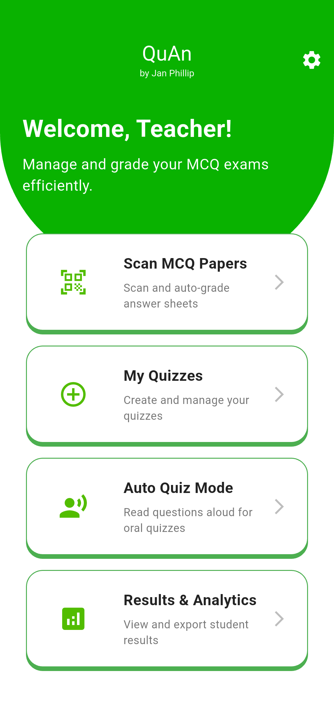
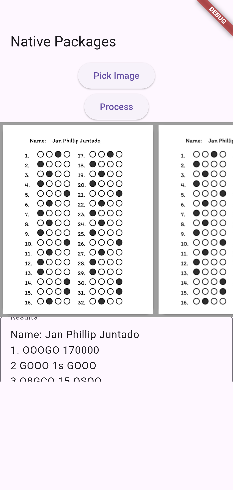
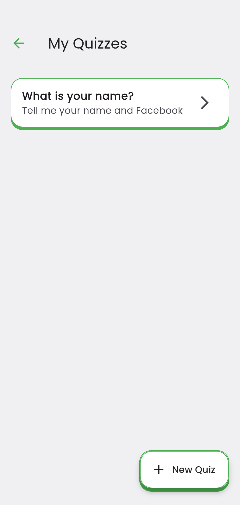
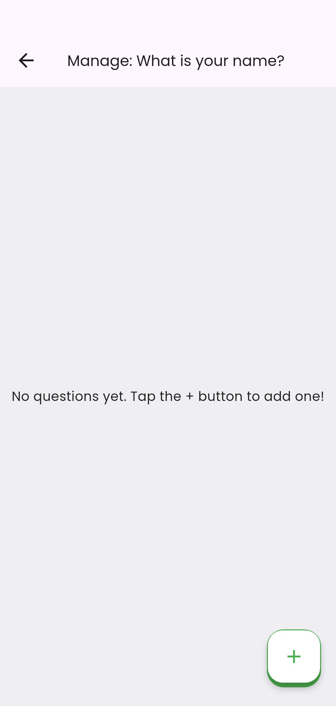

# QuAn: Qu-estion and An-swer for Teachers

### From the Bisakol word: "kuan" 
#### - a versatile word used as a filler, similar to "uh" or "um" in English. It can also mean "that thing," "something," or even "like" or "for example" depending on the context.
It uses OCR and trade-secret algorithms to help teachers in managing classwork.
### Teachers are our heroes and in the race for automation, we should give back to them by helping them manage their classwork with AI.
### This project helps teachers create a stable environment for managing classwork.

# Screenshots

###Project still under development.

##For collaborations, Please contact [Jan Phillip Juntado](mailto:juntado38@gmail.com)
